## 计算机大数据毕业设计知识图谱(neo4j)+大语言模型(LLM)的图检索增强(GraphRAG)的旅游推荐系统 旅游可视化 大数据毕设(源码+LW+教程+讲解+PPT)

## 要求
### 源码有偿！一套(论文 PPT 源码+sql脚本+教程)

### 
### 加好友前帮忙start一下，并备注github有偿26大模型旅游
### 我的QQ号是2827724252或者798059319或者 1679232425或者微信:biyesheji1698 或者 bysj2023nb

# 

### 加qq好友说明（被部分 网友整得心力交瘁）：
    1.加好友务必按照格式备注
    2.避免浪费各自的时间！
    3.当“客服”不容易，repo 主是体面人，不爆粗，性格好，文明人。
## 主要功能 
###  用户端功能
```
1.用户管理：注册、登录、个人信息管理、密码修改
2.景点浏览：景点列表、详情查看、搜索筛选、分类浏览、地图位置查看
3.个性化推荐：基于用户行为的智能推荐（协同过滤、内容推荐）
4.智能对话：AI助手对话式景点推荐，支持多轮对话
5.用户行为：收藏、点赞、评论、浏览记录、预约记录
6.个人中心：收藏夹、浏览历史、预约历史、个人信息管理
7.聊天系统：多会话管理、消息历史、会话删除
```


### 管理端功能
```
1.数据统计：用户数、景点数、分类数、行为数、标签数统计
2.用户管理：用户信息查看、状态管理、密码重置、用户删除
3.景点管理：景点CRUD操作、分类管理、标签管理、地图位置选择
4.知识图谱管理：数据同步(mysql同步到neo4j)、图谱可视化、统计分析
5.用户行为分析：用户行为历史查看
核心推荐功能
1.协同过滤推荐：基于用户相似性的推荐算法
2.内容推荐：基于景点内容相似性的推荐算法
3.对话式推荐：基于自然语言对话的智能推荐
4.图检索增强：利用知识图谱进行更精准的推荐(GraphRAG)
```


## 运行视频
https://www.bilibili.com/video/BV12vgnzLExm

## 运行截图
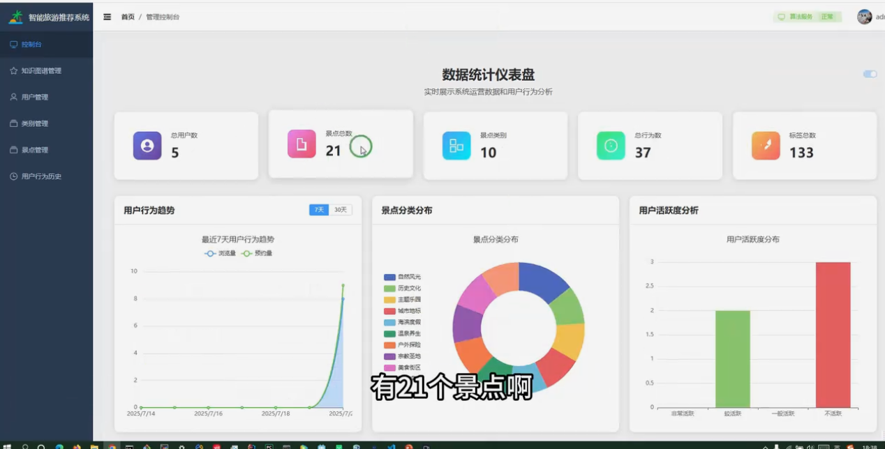
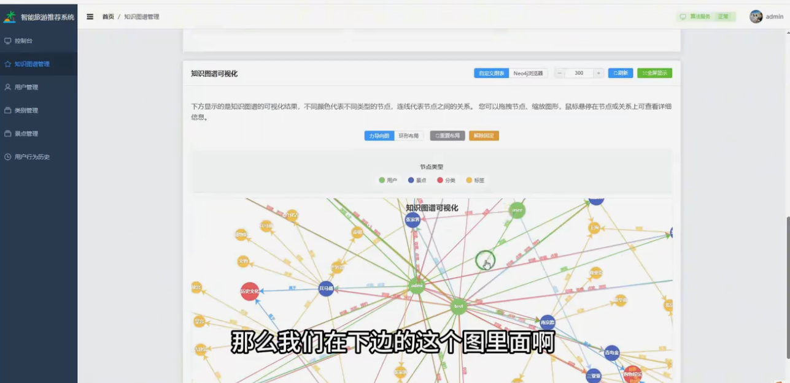
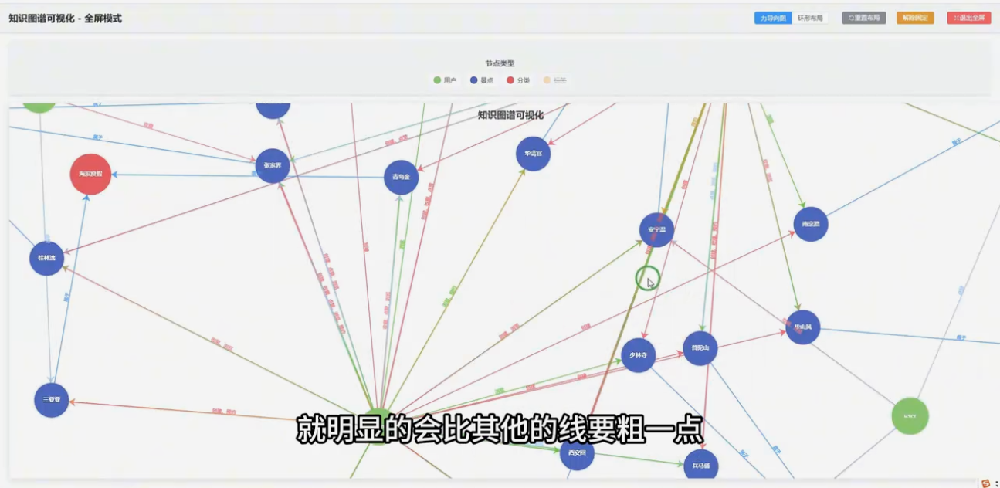
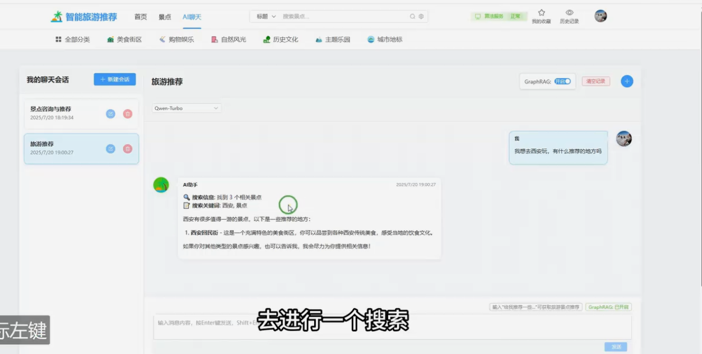
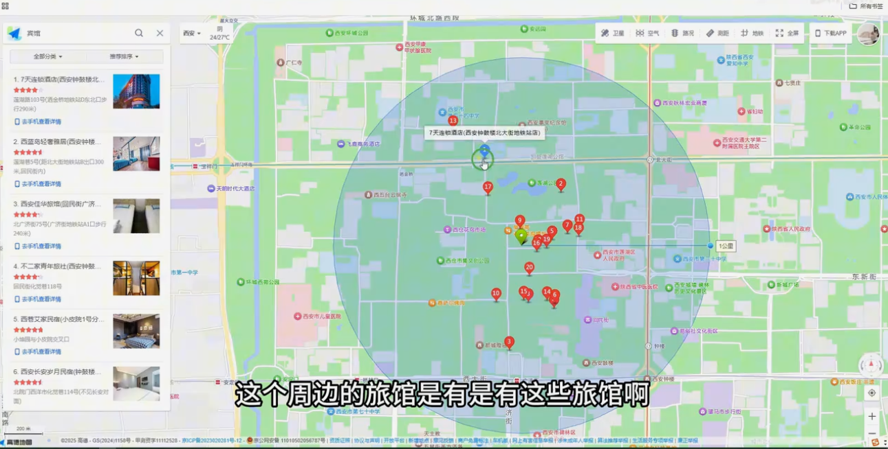
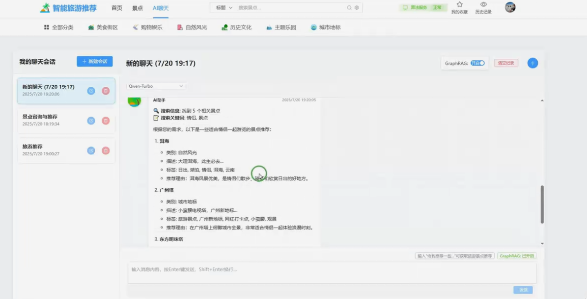
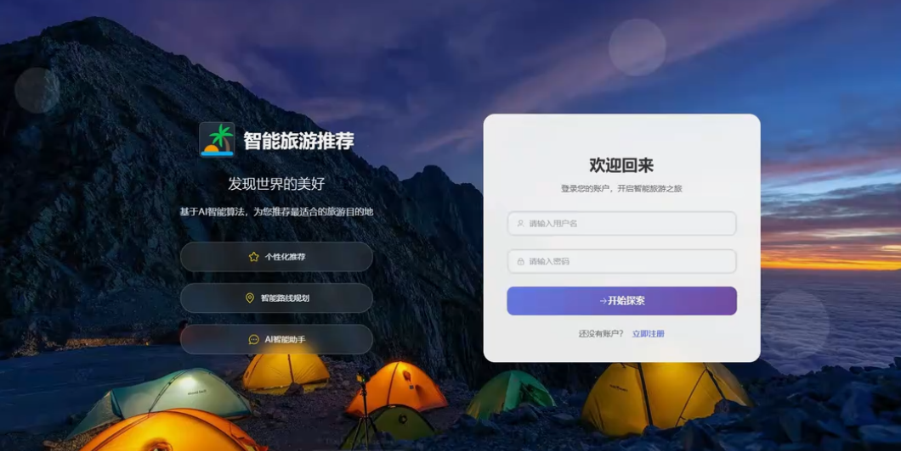
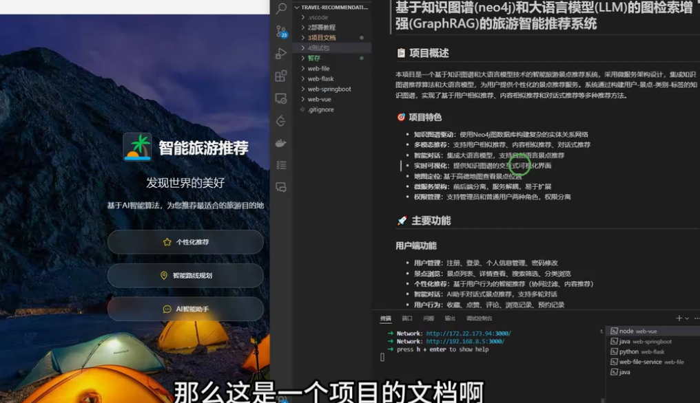
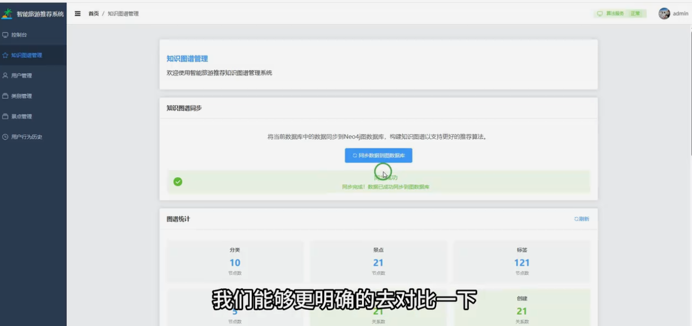
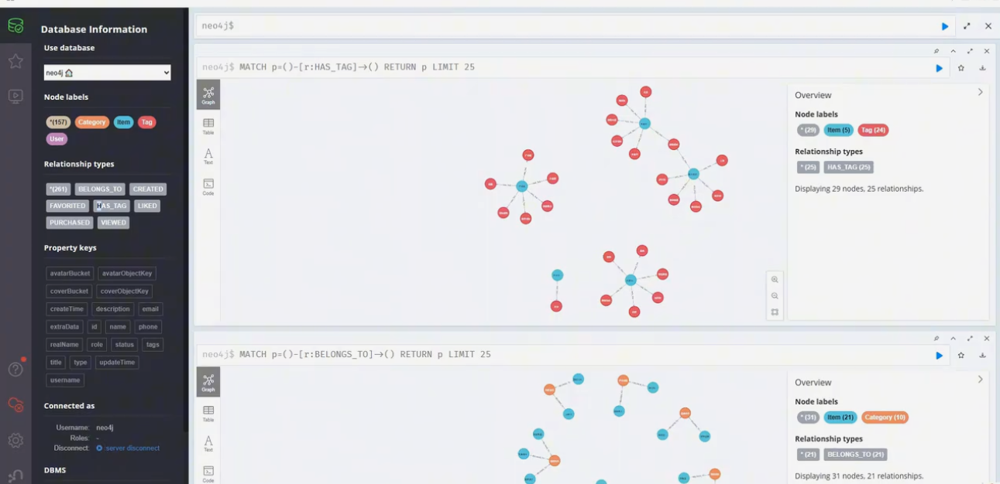
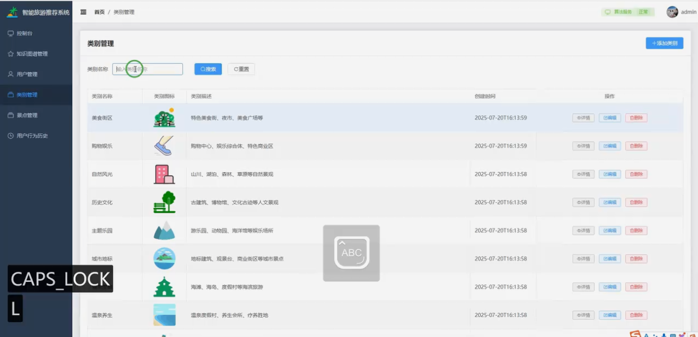
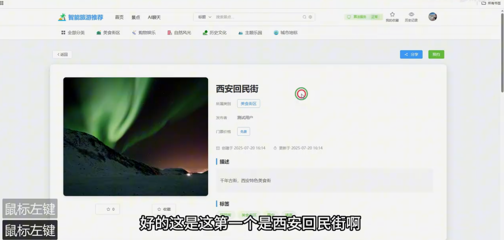
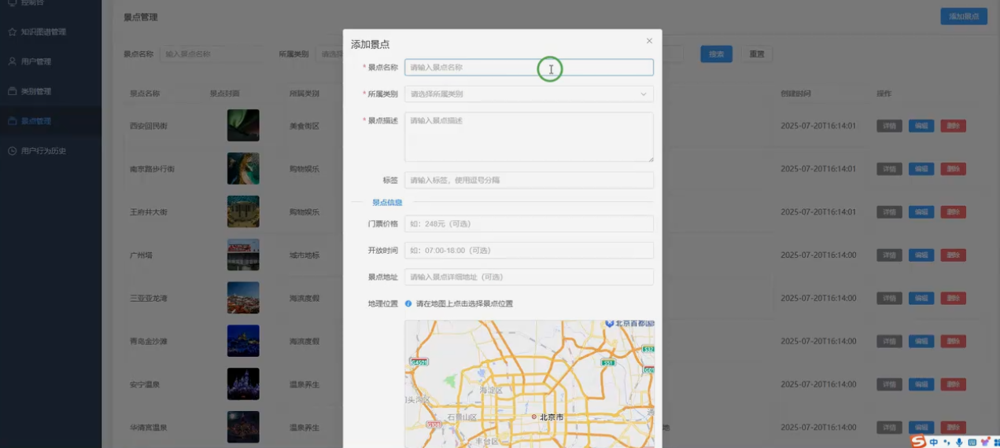
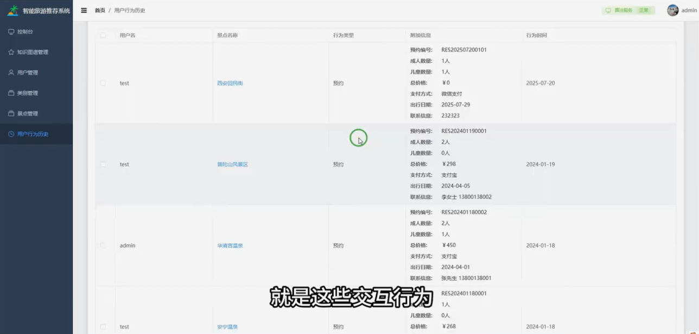
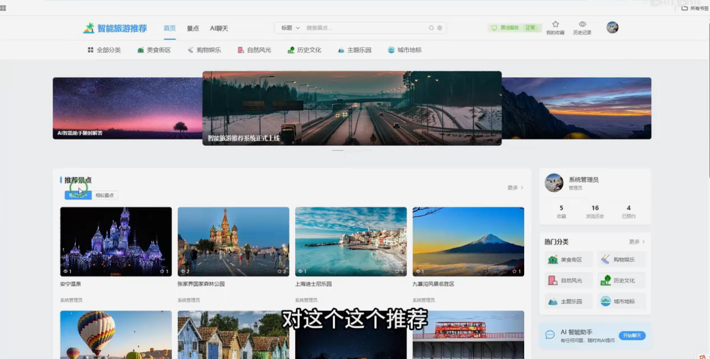
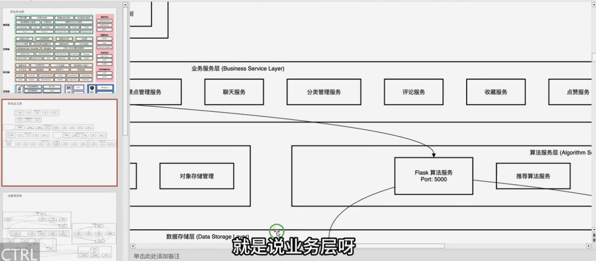


